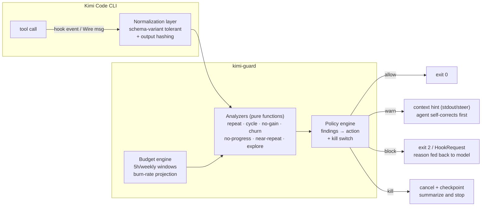
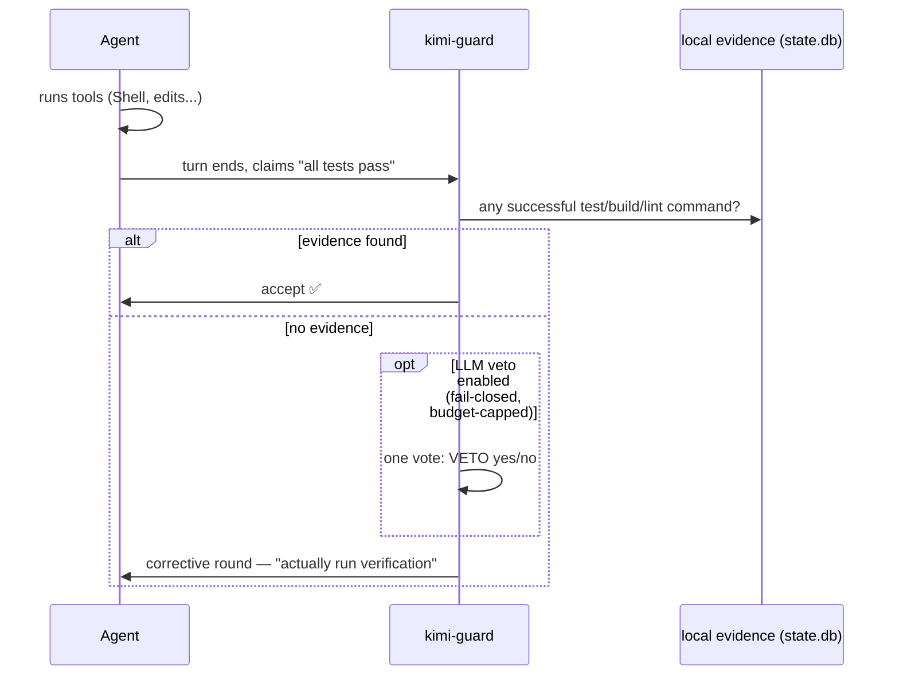

<div align="center">

# 🛡️ agent-guard (formerly kimi-guard)

**A runtime behavior guard for coding agents — [Kimi Code CLI](https://github.com/MoonshotAI/kimi-code) and [Claude Code](https://code.claude.com) — stop runaway agent loops before they burn your quota.**

`npm i -g @shidesheng0218/agentguard && agentguard install` → done. (Existing users: your installed `kimi-guard` keeps working — its `kguard` bin and hook entries stay live.)

[](https://www.npmjs.com/package/@shidesheng0218/agentguard)
[](/LICENSE)
[](/.github/workflows/ci.yml)


**[English](README.md) · [中文文档](docs/README.zh-CN.md)**

<div align="center">


*Real terminal session: install → verify → a supervised run where the circuit breaker catches a looping tool call → live status & budget panels. Recorded with [vhs](https://github.com/charmbracelet/vhs) from actual commands ([demo.tape](assets/demo.tape)).*

</div>

</div>

---

## Why

Kimi Code CLI is a great open-source coding agent, but its subagent system has known reliability gaps (see issues [#2142](https://github.com/MoonshotAI/kimi-cli/issues/2142), [#2368](https://github.com/MoonshotAI/kimi-cli/issues/2368), [#2578](https://github.com/MoonshotAI/kimi-cli/issues/2578)):

- The model repeats the **exact same tool call** dozens of times (76×, 112× observed in the wild), silently burning tokens — fatal for headless/CI runs where nobody presses Ctrl+C.
- All subagents share **one API key**, so a burst of parallel dispatches exhausts TPM/RPM and everything hangs.
- A mid-batch quota error leaves **half-written workspaces** that poison the whole run.

kimi-guard is a local, zero-daemon guard that sits on the CLI's official [hooks system](https://www.kimi.com/code/docs/en/kimi-code-cli/customization/hooks.html) and enforces hard caps — no source forking, no proxy, no account access.

Since v0.8 the same engine also guards **Claude Code** via its [hooks system](https://code.claude.com/docs/en/hooks) (`agentguard install` auto-detects installed harnesses). Wire-mode supervision (`agentguard run`), mid-turn steering and official-API quota metering remain Kimi-exclusive; loop/churn/explore detection, quota gates, the completion gate, kill switch and checkpoints work on both.

## Features

kimi-guard is not a preset pack — it is a **runtime behavior analysis and enforcement engine**. Every tool call flows through a normalization layer, a set of pure analyzers, and a policy engine that maps findings to actions (observe / warn / block / full stop).

| Guard | Signal it detects | Action |
|---|---|---|
| 🔁 **Repetition** | same `(tool, args)` signature re-run N times (whitespace-tolerant fingerprinting) | block |
| 🔄 **Cycle detection** | oscillating loops: `A→B→A→B…` up to period-3, regardless of tool | block |
| 📉 **No-information-gain** | different arguments, byte-identical output — the model is spinning without new data (the real root cause of upstream [#2142](https://github.com/MoonshotAI/kimi-cli/issues/2142) Case B) | warn → block |
| ✏️ **Edit churn** | the same file edited over and over without converging ("thrashing") | warn → block |
| 🐢 **No-progress stretch** | long run of tool calls with no successful edit landing — motion without progress | warn → block |
| 🔭 **Exploration drift** | long streak of read/search calls with no action in between — exploring without implementing | warn → block |
| 🎯 **Goal anchor** | re-injects the original task verbatim every N prompts/steps and always after compaction — the two moments a long session drifts off-target | context injection |
| 🚦 **Quota gate** | request accounting against Kimi Coding Plan windows (5h/weekly) with burn-rate projection; dispatches are blocked before the window is exhausted | warn → block |
| 🔌 **Kill switch** | after N interventions in a session, block ALL tools and order the model to summarize and end its turn — the fuse for unattended/CI runs | full stop |
| 🧯 **Context-fill gate** | when the context window crosses the threshold (Wire mode reads `StatusUpdate.context_usage`), steers a wrap-up warning before compaction hits | mid-turn steer |
| 🧾 **Completion gate** | deterministic claim-vs-evidence check: "tests pass" claims are matched against the locally recorded command history — an unbacked claim triggers a corrective round (Wire) or blocks the turn end (hooks, opt-in). Optionally an **LLM veto vote** (self-critic style: the LLM only votes to suppress false positives, never authors a critique) | verify round / block / veto |
| 🧠 **Thinking dominance** | flags turns that burned ≥20k chars of pure reasoning with ≤10% visible action — fed back as "act more, think less" on the next resume | flag + resume note |
| 🔁 **Near-duplicate matching** | fuzzy loop detection: arguments differing only in punctuation, case, spacing or order still collapse to one signature | warn → block |
| 💾 **Checkpoint / resume** | auto-captures an observed "research state" brief (files touched, commands, searches, failed calls) on failure/interrupt/session-end; `kguard resume` prints a paste-ready context block so a resumed session skips re-exploration | recovery |
| 🎮 **`kguard run` (Wire supervisor)** | spawns the agent in Wire mode (JSON-RPC) and supervises it *in-process*: hook decisions with zero exit-code overhead, **mid-turn steering** on warn findings, **exact per-step token metering** from `StatusUpdate`, retry observability (`StepRetry` status codes), approval policy for headless runs, hard step/time caps with `cancel`, auto-resume with checkpoint injection, and a full run report + raw wire log | CI / unattended runs |

Warn-level findings are injected into the model's context (official hooks stdout mechanism) so the agent can correct itself *before* a block becomes necessary. Blocks feed a structured reason back to the model (official exit-code-2 mechanism).

Everything is **fail-open**: if kimi-guard itself errors, the agent keeps working. It is a safety net, not a single point of failure.

## Install

```sh
npm i -g @shidesheng0218/agentguard
agentguard install    # writes managed hooks into every detected harness
                      # (Kimi Code: ~/.kimi-code/config.toml · Claude Code: ~/.claude/settings.json)
agentguard doctor     # verify
```

Requires Node >= 22.13. Restart the agent CLI (or `/reload`) after installing.

Claude Code users can also install via the plugin channel (this repo is a self-hosted marketplace):

```
/plugin marketplace add shidesheng0218/kimi-guard
/plugin install agent-guard@agentguard
```

(The plugin's hooks call the `agentguard` CLI — install it globally first; without it the hooks fail-open.)

### Harness support

| Capability | Kimi Code CLI | Claude Code |
|---|---|---|
| Loop / churn / explore detection, kill switch | ✅ hooks | ✅ hooks |
| Quota gates | ✅ event-based + official-API precise (`[budget] precise`) | ✅ event-based estimates |
| Completion gate (claim vs evidence) | ✅ | ✅ |
| Checkpoints / resume, feedback loop, reports | ✅ | ✅ |
| `agentguard run` Wire supervision, mid-turn steer | ✅ | — (hooks only) |

<details>
<summary>What <code>agentguard install</code> writes</summary>

Kimi Code (`~/.kimi-code/config.toml`):

```toml
# >>> kimi-guard managed >>> DO NOT EDIT
[[hooks]]
event = "PreToolUse"
command = "agentguard hook PreToolUse"
timeout = 5

[[hooks]]
event = "PostToolUse"
command = "agentguard hook PostToolUse"
timeout = 5

[[hooks]]
event = "PostToolUseFailure"
command = "agentguard hook PostToolUseFailure"
timeout = 5

# + observation hooks: TurnStarted, SubagentStart, StopFailure, Interrupt, SessionEnd
# (these feed the budget metering and auto-checkpointing engines)
# <<< kimi-guard <<<
```

Claude Code (`~/.claude/settings.json`):

```json
{
  "hooks": {
    "PreToolUse": [
      { "matcher": "", "hooks": [{ "type": "command", "command": "agentguard hook PreToolUse --harness claude", "timeout": 5 }] }
    ]
  }
}
```

(+ PostToolUse, PostToolUseFailure, UserPromptSubmit, Stop, SubagentStart, SessionStart/End, PreCompact/PostCompact, StopFailure — the events the guard handles.)

- Analyzers decide *which* tools to watch internally — the hooks observe everything, so the watch lists stay configurable without reinstalling.
- A backup is created before the first install (`config.toml.kimi-guard.bak` / `settings.json.agentguard.bak`). `agentguard uninstall` removes the entries cleanly from both harnesses. The Kimi block coexists with other tools' managed blocks (e.g. kimi-boost).
- **Legacy compatibility**: if your CLI version rejects unknown hook events (older kimi-cli builds), run `agentguard install --compat` to write only the 3 universally supported events. You keep loop guarding; you lose auto-checkpointing and event-based metering.

</details>

## Commands

```sh
# binary is `agentguard`; `kguard` / `kimi-guard` remain as aliases — all commands work with either name
kguard install          # add hook rules to detected agent CLIs (idempotent)
kguard uninstall        # remove the managed hook block
kguard status           # calls, interventions, sessions, budget windows + intervention quality
kguard budget           # quota metering snapshot: windows, burn rate, projection
kguard blocks [-n N]    # recent blocks with ids
kguard feedback fp|tp <id>  # mark a block false-positive / confirmed — calibrates detectors
kguard report [--json]  # anonymized aggregate export (safe to share)
kguard checkpoint       # capture a research-state checkpoint now
kguard resume           # print a paste-ready context block from the latest checkpoint
kguard run -- <prompt>  # supervised headless run in Wire mode (see below)
kguard doctor           # verify node/state db/config/PATH/probe
kguard probe on|off|show [−n N]   # capture raw hook payloads
kguard config init|show|get <key> # manage ~/.kimi-guard/config.toml
kguard hook <event>     # (used by the CLI, reads JSON from stdin)
```

### `kguard run` — supervised headless runs

This is the tool for CI, cron jobs and unattended agents — the exact scenario where a
repeating tool call burns the full timeout (upstream issue #2142 was a headless run).

```sh
kguard run "refactor the auth module and make tests pass" \
  --max-steps 100 --max-minutes 20 --auto-resume 1 --json
```

What the supervisor does in-process (no shell hooks, no exit codes):

- subscribes to `PreToolUse` over the Wire protocol and returns `allow/block` decisions — the same analyzers, zero-latency
- **steers** the agent mid-turn (`steer`) when a warn-level pattern appears, before a hard block is needed
- meters **exact token usage per step** from `StatusUpdate.token_usage`
- observes retry storms (`StepRetry` with status codes → 429 visibility)
- enforces hard caps: `--max-steps` (cancel via official `cancel` method), `--max-minutes`
- **kill switch**: after N blocks it cancels the turn and checkpoints
- approval policy: default rejects with feedback (headless-safe), `--yolo` approves
- writes a run report (`report.json`) + raw wire log (`wire.jsonl`) under `~/.kimi-guard/runs/`
- exit code 0 on clean finish, 2 on any intervention-triggered end — CI-friendly

## Configuration

`~/.kimi-guard/config.toml` (see `kguard config init`; full annotated template included):

```toml
[tools]                 # canonical tool-name taxonomy — if your CLI renames tools, fix it HERE
edit = ["WriteFile", "StrReplaceFile", "Edit", "Write", "MultiEdit", "NotebookEdit"]
read = ["ReadFile", "Read"]
search = ["Grep", "Glob"]
shell = ["Shell", "Bash"]     # verify evidence + veto context read this (legacy [verify] shellTools still works)

[repeat]                # exact/near-duplicate repetition
maxRepeats = 3
warnAt = 2              # soft context warning before the hard block
windowMinutes = 30
# exemptPatterns = [...] # regexes over JSON-serialized args; matching calls are never repeat-blocked (polling commands)

[cycle]                 # A->B->A->B oscillation detection
enabled = true

[noGain]                # different args, identical output
warnAt = 3
blockAt = 4

[churn]                 # same-file edit thrashing
warnAt = 5
blockAt = 10

[noProgress]            # long stretch of calls with no landed edit
warnAt = 15
blockAt = 25

[anchor]                # goal anchoring (anti-drift)
everyNPrompts = 5
maxChars = 1000

[context]
warnPercent = 85        # steer a wrap-up warning when the context is this full

[nearRepeat]            # fuzzy near-duplicates (punctuation/case/order differences)
warnAt = 6
blockAt = 10

[explore]               # pure-exploration streak: reads/searches with no action in between
warnAt = 10
blockAt = 15

[verify]                # completion-claim gate
enabled = true
blockOnNoEvidence = false  # hooks path: block Stop when edits landed but nothing was verified
evidenceWindowMinutes = 60

[verify.veto]           # optional false-positive suppression vote (off by default, zero deps when off)
enabled = false         # requires KIMI_GUARD_VETO_API_KEY in the environment (any OpenAI-compatible endpoint)
model = "kimi-k3"       # use a cheap fast model — the vote costs a few hundred tokens
maxCallsPerSession = 3  # the model cannot retry its way out of the gate

[thinking]              # thinking-dominance detection (Wire mode)
minThinkChars = 20000
maxTextRatio = 0.1

[policy]
killSwitch = true       # after maxBlocksPerSession interventions, block ALL tools
maxBlocksPerSession = 5

[budget]                # request accounting for Kimi Coding Plans
plan = "tier1"          # tier1: 1024/week | tier2: 2048 | tier3: 7168 (200 per 5h)
reservePercent = 10     # headroom the agent is never allowed to eat
subagentWeight = 5      # ~requests each dispatched subagent costs
precise = false         # poll the official Kimi usage API for exact windows (needs KIMI_API_KEY, sk-kimi-...)
                        # falls back to event-based estimates on any error — fail-open
```

## How it works



The completion gate adds a claim-vs-evidence loop on top:



```
Kimi Code CLI ──hook event──▶ kguard hook <event> (JSON on stdin)
                                  │
                    ┌─────────────▼──────────────┐
                    │  normalization layer        │  schema-variant tolerant payload
                    │  (src/events.ts)            │  → canonical call record + output hash
                    └─────────────┬──────────────┘
                    ┌─────────────▼──────────────┐
                    │  analyzers (pure functions) │  repetition · cycles · no-gain · churn
                    │  (src/analysis.ts)          │  + budget gate (src/meter.ts)
                    └─────────────┬──────────────┘
                    ┌─────────────▼──────────────┐
                    │  policy engine              │  findings → allow / warn / block
                    │  (src/policy.ts)            │  + kill switch
                    └─────────────┬──────────────┘
                                  │
              allow (exit 0) · warn (exit 0 + context hint) · block (exit 2 + reason)
                                  │
                       ~/.kimi-guard/state.db (SQLite via node:sqlite)
                       checkpoints/<session>/<ts>.md
```

- `PreToolUse` **exit 2** is the official blocking mechanism: the CLI feeds stderr back to the model as a correction.
- `PreToolUse` **stdout** on warn is appended to the model context — a soft nudge before a hard block.
- `TurnStarted`/`SubagentStart`/`StopFailure`/`Interrupt`/`SessionEnd` hooks feed the metering and checkpoint engines.

## Roadmap

- [ ] **v0.7** — per-agent model routing (needs upstream `model` field on subagent dispatch, [#2533](https://github.com/MoonshotAI/kimi-cli/issues/2533)); git-worktree partial-work isolation for parallel agents
- [x] exact plan-usage windows via the official Kimi usage API (v0.6.2, `[budget] precise = true`; event-based estimates remain the fail-open fallback)
- [ ] cross-harness adapters — see [docs/PORTING.md](docs/PORTING.md) for the reusable-core checklist

## Ecosystem fit

The agent-runtime tooling space is crowded, and pretending every tool competes with every other one helps nobody. kimi-guard occupies one specific layer — here is the honest map:

```
┌────────────────────────────────────────────────────────────────┐
│  your agent (Kimi Code CLI)                                    │
│                                                                │
│  built-in loop_control      step/attempt caps + compaction     │
│  ├─ mechanical counter — stops the loop, explains nothing       │
│                                                                │
│  ┌──────────────────────────────────────────────────────────┐  │
│  │  kimi-guard (this project) — the enforcement layer       │  │
│  │  semantic loop detection · quota gates · steering ·      │  │
│  │  checkpoints · goal anchoring — the agent cannot bypass  │  │
│  └──────────────────────────────────────────────────────────┘  │
│                                                                │
│  kimi-session-orchestrator  voluntary orchestration layer      │
│  ├─ MCP tools the AGENT chooses to call (grade_step, retire)   │
│  ├─ great when the agent cooperates; has no veto power         │
│                                                                │
│  kimi-boost                  security preset installer         │
│  ├─ dangerous-command guards, branch protection, skills       │
│  ├─ WHAT the agent may do (security) — different axis from    │
│  │  kimi-guard's HOW it behaves (runtime loops/budget)        │
│                                                                │
│  cli-agent-runner            lifecycle supervisor              │
│  ├─ 7×24 restart loops, log-level anomaly detection           │
│  ├─ between-rounds layer — complements our within-round layer │
│                                                                │
│  ccusage / kimi-code-usage    read-only usage monitors         │
│  ├─ tell you what happened AFTER — never block anything       │
└────────────────────────────────────────────────────────────────┘
```

**Three lines of positioning:**

1. **Monitors are plentiful, voluntary orchestrators exist — but a non-bypassable enforcement layer, kimi-guard is the first in the Kimi ecosystem.** (ccusage-family tools are read-only; kimi-session-orchestrator relies on the agent choosing to call it; kimi-guard intercepts.)
2. **Mid-turn steering is an intervention outside the hook-lifecycle boundary — no verified analog does it: external supervisors (e.g. [loop-eng/loopguard](https://github.com/loop-eng/loopguard)) can only SIGSTOP-pause the process and post a desktop notification; in-process detector libraries ([LoopBuster](https://github.com/liuchunwei732-cmyk/loopbuster)) need the host app to honor them; security-hook suites (cc-safety-net) act pre-execution only. We do it natively over the official Wire protocol.**
3. **The budget model understands Kimi's subscription semantics: 5h/weekly request windows, reserved headroom, burn-rate projection — USD-billing competitors don't reconcile against plan-based users.**

**What we deliberately do NOT do** (so you know where to look):

- Security scanning / destructive-command guards → use **kimi-boost** presets (different axis: authorization vs behavior). `kguard doctor` detects whether a security layer is present and points you there if not.
- Completion verification exists in kimi-guard as a **deterministic claim-vs-evidence gate** (no LLM in the loop), with an *opt-in* single-vote LLM veto for false positives (`VETO: yes|no` protocol, per-session budget cap, fail-closed on any error). For richer semantic verification (refute-by-default judges, LLM grading), see kimi-session-orchestrator's `grade_step` or the refute-by-default pattern in multi-runtime governance suites.
- Multi-runtime portability (Claude Code / Codex / Gemini) → by design, our leverage is Kimi's Wire protocol. The analyzer core (`src/analysis.ts`) is pure functions and reusable if you want to build adapters
- Daemon-style process supervision (SIGSTOP/SIGCONT, systemd) → **cli-agent-runner** owns that layer; ours is semantic in-harness intervention

Related Kimi-ecosystem projects worth knowing: [kimi-session-orchestrator](https://github.com/FirenzeClaw/kimi-session-orchestrator) (multi-session orchestration), [oh-my-kimi](https://github.com/xz1220/oh-my-kimi) (skill/hook presets), [cli-agent-runner](https://github.com/wan9yu/cli-agent-runner) (lifecycle supervision with a kimi preset), [kimi-code-usage](https://github.com/Golden0Voyager/kimi-code-usage) (read-only usage reporting). kimi-guard and [kimi-boost](https://github.com/shidesheng0218/kimi-boost) come from the same author and are designed as a pair: boost covers the authorization axis, guard the behavior axis.

### The cross-ecosystem landscape (verified 2026-09)

The behavioral-enforcement niche is not just empty in the Kimi ecosystem — a survey of the wider coding-agent tooling space found no shipped equivalent:

| Tool | Mechanism | What it can/cannot do vs kimi-guard |
|---|---|---|
| [cc-safety-net](https://github.com/kenryu42/cc-safety-net) (1.5k★, 13 CLIs incl. Kimi Code) | pre-execution hooks | Blocks dangerous commands/secret access — the authorization axis. No loop detection, no quotas, no steering. Proves multi-runtime hooks appetite. |
| [ccusage](https://github.com/ccusage/ccusage) (18k★) | log analytics | Read-only cost/token reports over 18 agent CLIs. Never blocks. The usage-data layer is commoditized; enforcement is the open layer. |
| [LoopBuster](https://github.com/liuchunwei732-cmyk/loopbuster) (83★) | in-process library | Detector set nearly identical to ours (fuzzy repeat / cycles / output stagnation) — but inside LangGraph/CrewAI apps, not CLIs. Independent convergent evidence the detector taxonomy is right. |
| [loop-eng/loopguard](https://github.com/loop-eng/loopguard) (0★) | supervisor daemon (SIGSTOP) | Multi-runtime loop watching with $-caps, but freezes the process and posts a desktop notification — useless headless, no steering, no semantics. |
| [claudewatch](https://github.com/blackwell-systems/claudewatch) (9★, stalled) | PostToolUse hooks + MCP | Closest prior art for hook-feedback steering ("you're looping, call get_blockers()") — Claude Code only, inactive since 2026-03. |
| [ralph](https://github.com/frankbria/ralph-claude-code) (9.6k★) | shell wrapper loop | Exit gates and rate limits at iteration boundaries only — works around runaway agents by restarting, doesn't govern them. |
| NeMo Guardrails / Guardrails AI / Langfuse / LangSmith / Helicone | content rails / SDK / proxy / SaaS | Structurally cannot intercept a local CLI's tool calls: proxies see only model HTTP traffic, content validators see text, observability is after-the-fact. |

**The takeaway:** monitors are commoditized, security hooks are crowded, orchestration is well-served — behavioral, semantic, mid-run enforcement of a local coding CLI is the layer nobody ships. kimi-guard's moat is the combination, not any single feature: hook/Wire access point × semantic detectors × subscription-aware budgeting. The main strategic risk is single-runtime binding; the analyzer core is pure functions ([PORTING.md](docs/PORTING.md)) precisely so adapters can widen it.

## Compatibility

- Kimi Code CLI hooks (Beta) and Claude Code hooks (33 events; we use the 11 the guard handles). Hook payloads are parsed defensively; run `agentguard probe on` + `agentguard doctor` to see the exact fields your CLI version sends.
- Config detection: `$KIMI_CONFIG_PATH` → `~/.kimi-code/config.toml` → `~/.kimi/config.toml`; Claude: `$CLAUDE_SETTINGS_PATH` → `~/.claude/settings.json`.
- Guard state dir: `$AGENT_GUARD_HOME` → `$KIMI_GUARD_HOME` → `~/.agent-guard` (existing `~/.kimi-guard` keeps working in place).

## License

MIT
