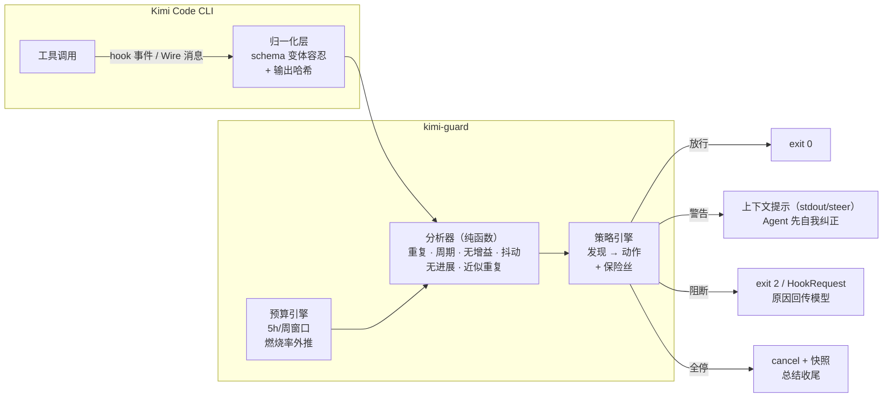
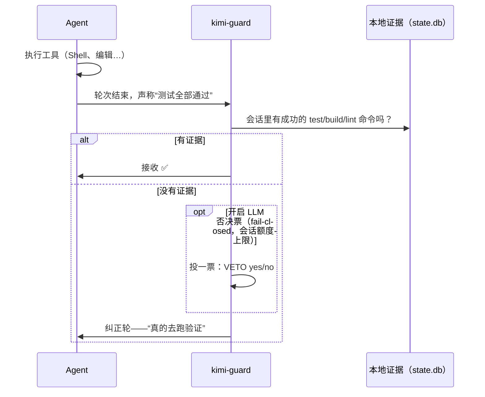

<div align="center">

# 🛡️ kimi-guard

**给 Kimi Code CLI 加一层编排守护：在 Agent 失控烧掉你的额度之前把它拦下来。**

`npm i -g kimi-guard && kguard install` → 装完即用。

</div>

---

<div align="center">


*真实终端演示：安装 → 自检 → 受监督运行中熔断器拦下一个循环调用 → 实时状态与预算面板。由 [vhs](https://github.com/charmbracelet/vhs) 从真实命令录制（[demo.tape](../assets/demo.tape)）。*

</div>

---

## 为什么需要

Kimi Code CLI 是优秀的开源编码 Agent，但它的子代理系统存在已知可靠性缺口（见上游 issue [#2142](https://github.com/MoonshotAI/kimi-cli/issues/2142)、[#2368](https://github.com/MoonshotAI/kimi-cli/issues/2368)、[#2578](https://github.com/MoonshotAI/kimi-cli/issues/2578)）：

- 模型会**重复执行完全相同的工具调用**——实测出现过同一命令连跑 76 次、112 次，无人值守/CI 场景下直接烧满超时和 token。
- 所有子代理**共享同一个 API key**，一批并行派发就能把 TPM/RPM 打爆，全部挂起。
- 批次中途配额报错会留下**写了一半的工作区**，毒害整个任务。

kimi-guard 是一个本地零守护进程的守护层，挂在 CLI 官方 [Hooks 系统](https://www.kimi.com/code/docs/kimi-code-cli/customization/hooks.html) 上强制熔断——不 fork 源码、不走代理、不碰账号。

## 功能

kimi-guard 不是预设包，而是一个**运行时行为分析与执行引擎**。每次工具调用都会经过归一化层 → 纯函数分析器 → 策略引擎，产出分级动作（观察 / 警告 / 阻断 / 全停）。

| 守护 | 检测信号 | 动作 |
|---|---|---|
| 🔁 **重复调用** | 同一 `(工具, 参数)` 签名重跑 N 次（空白符容忍指纹） | 阻断 |
| 🔄 **周期循环** | 振荡循环 `A→B→A→B…`（检测到 3 步周期），不限工具 | 阻断 |
| 📉 **无信息增益** | 参数不同但输出逐字节相同——模型在空转打转（上游 [#2142](https://github.com/MoonshotAI/kimi-cli/issues/2142) Case B 的真正根因） | 警告 → 阻断 |
| ✏️ **编辑抖动** | 同一文件被反复修改却不收敛（thrashing） | 警告 → 阻断 |
| 🐢 **无进展串** | 长串工具调用没有任何成功落盘的编辑——只有动作没有进展 | 警告 → 阻断 |
| 🎯 **目标锚定** | 每 N 个 prompt/步重新注入原始任务原文，compaction 后必注入——长会话跑偏的两个高发时刻 | 上下文注入 |
| 🚦 **配额闸门** | 针对 Kimi Coding Plan 的请求计量（5h/周窗口）+ 燃烧率预测，窗口耗尽前提前禁止派发 | 警告 → 阻断 |
| 🔌 **保险丝** | 单会话干预 N 次后封锁全部工具，强制模型总结收尾——无人值守/CI 场景的最后一道保险 | 全停 |
| 🧯 **上下文闸门** | 上下文窗口越过阈值（Wire 模式读 `StatusUpdate.context_usage`）时，在压缩到来前 steer 一个收尾提醒 | 轮中纠偏 |
| 🧾 **完工闸门** | 确定性"声明 vs 证据"核查：从会话本地命令史里找"测试通过"声明的证据——没有证据的声明触发一轮纠正重跑（Wire）或阻断轮次结束（hooks，可选开启）。可选叠加**LLM 否决票**（self-critic 风格：LLM 只投票抑制误报，不写评判） | 纠正轮 / 阻断 / 否决 |
| 🧠 **思维占比** | 标记烧了 ≥2 万字符纯推理、可见动作 ≤10% 的轮次——下次续跑时回传"多动手少空想" | 标记 + 续跑提示 |
| 🔁 **近似重复匹配** | 模糊循环检测：参数仅在标点/大小写/空格/顺序上不同的调用仍折叠为同一签名 | 警告 → 阻断 |
| 💾 **快照/恢复** | 失败/中断/会话结束时自动捕获"研究状态简报"（动过的文件、跑过的命令、搜索轨迹、失败调用）；`kguard resume` 输出可直接粘贴的上下文块，恢复的会话不再重新探索 | 恢复 |
| 🎮 **`kguard run`（Wire 监督者）** | 以 Wire 模式（JSON-RPC）拉起 Agent 并**进程内**监督：HookRequest 编程式阻断（零 exit code 开销）、warn 级发现的**轮中纠偏（steer）**、基于 `StatusUpdate` 的**每步精确 token 计量**、重试风暴观测（`StepRetry` 带 429 状态码）、headless 审批策略、步数/时长硬上限（官方 `cancel`）、注入快照的自动续跑、完整运行报告 + 原始 Wire 日志 | CI / 无人值守 |

警告级发现通过官方 stdout 机制注入模型上下文，让 Agent **在阻断发生前自我纠正**；阻断时把结构化原因回传给模型（官方 exit code 2 机制）。

一切 **fail-open**：kimi-guard 自身出错时 Agent 照常工作。它是安全网，不是单点故障。

## 安装

```sh
npm i -g kimi-guard
kguard install        # 向 ~/.kimi-code/config.toml 写入托管的 [[hooks]] 区块
kguard doctor         # 自检
```

需要 Node >= 22.13。安装后重启 Kimi Code CLI（或 `/reload`）生效。

- 分析器在内部决定监控哪些工具——hook 观察所有工具，监控清单可随时改配置，无需重装。
- 首次安装前自动备份（`config.toml.kimi-guard.bak`），`kguard uninstall` 干净移除，托管区块可与 kimi-boost 等其他工具的区块共存。
- **老版本兼容**：如果你的 CLI 版本不认识新 hook 事件（旧版 kimi-cli）导致配置加载失败，执行 `kguard install --compat` 只写 3 个通用事件——保留循环守护，放弃自动快照与事件计量。

## 常用命令

```sh
kguard install          # 写入 hook 规则（幂等，首次自动备份）
kguard uninstall        # 移除托管区块
kguard status           # 调用量、干预记录、会话、预算窗口
kguard budget           # 配额计量快照：窗口、燃烧率、耗尽预测
kguard checkpoint       # 立即捕获一次研究状态快照
kguard resume           # 输出可直接粘贴的恢复上下文块
kguard run -- <任务描述>  # Wire 模式下的受监督无人值守运行（见下）
kguard doctor           # 验证 node / 状态库 / 配置 / PATH / 探针
kguard probe on|off|show [-n N]   # 抓取原始 hook payload
kguard config init|show|get <key> # 管理 ~/.kimi-guard/config.toml
```

### `kguard run` — 受监督的无人值守运行

这是给 CI、定时任务、无人值守 Agent 用的——正是上游 #2142 里"同一命令连跑 76 次烧满 7200s 超时"的场景。

```sh
kguard run "重构 auth 模块并让测试通过" \
  --max-steps 100 --max-minutes 20 --auto-resume 1 --json
```

监督者全部在进程内完成（不依赖 shell hook、不依赖 exit code）：

- 通过 Wire 协议订阅 `PreToolUse`，直接返回 `allow/block` 决策——同一套分析器，零延迟
- warn 级模式出现时**轮中纠偏**（`steer`），在硬阻断发生前软提醒
- 从 `StatusUpdate.token_usage` 读取**每步精确 token 计量**
- 观测重试风暴（`StepRetry` 携带状态码 → 429 可见性）
- 硬上限：`--max-steps`（走官方 `cancel`）、`--max-minutes`
- **保险丝**：阻断 N 次后取消当前轮并落快照
- 审批策略：默认带反馈拒绝（headless 安全），`--yolo` 自动批准
- 在 `~/.kimi-guard/runs/` 下写运行报告（`report.json`）+ 原始 Wire 日志（`wire.jsonl`）
- 干净结束 exit 0，干预触发的结束 exit 2——对 CI 友好

## 配置

`~/.kimi-guard/config.toml`（`kguard config init` 生成带注释模板，`kguard config show` 查看生效值）：

```toml
[repeat]                # 精确/近似重复
maxRepeats = 3
windowMinutes = 30

[cycle]                 # A→B→A→B 振荡检测
enabled = true

[noGain]                # 参数不同、输出相同
warnAt = 3
blockAt = 4

[churn]                 # 同文件反复编辑
warnAt = 5
blockAt = 10

[noProgress]            # 长串调用无落盘编辑
warnAt = 15
blockAt = 25

[anchor]                # 目标锚定（防跑偏）
everyNPrompts = 5
maxChars = 1000

[context]
warnPercent = 85        # 上下文填充到该比例时 steer 收尾提醒

[nearRepeat]            # 模糊近似重复（标点/大小写/顺序差异）
warnAt = 6
blockAt = 10

[verify]                # 完工声明闸门
enabled = true
blockOnNoEvidence = false  # hooks 路径：有编辑落盘但零验证时阻断 Stop
evidenceWindowMinutes = 60

[verify.veto]           # 可选的误报抑制投票（默认关，关着就是零依赖）
enabled = false         # 需在环境变量设置 KIMI_GUARD_VETO_API_KEY（任何 OpenAI 兼容端点）
model = "kimi-k3"       # 用便宜快的模型——一票只花几百 token
maxCallsPerSession = 3  # 模型不能靠反复改口"洗"出放行

[thinking]              # 思维占比检测（仅 Wire 模式）
minThinkChars = 20000
maxTextRatio = 0.1

[policy]
killSwitch = true       # 干预 maxBlocksPerSession 次后封锁全部工具
maxBlocksPerSession = 5

[budget]                # Kimi Coding Plan 请求计量
plan = "tier1"          # tier1: 1024/周 | tier2: 2048 | tier3: 7168（每 5h 200）
reservePercent = 10     # 给你保留的余量，Agent 永远不能吃掉
subagentWeight = 5      # 每个派发子代理的请求折算
```

## 工作原理



完工闸门在其上叠加一个"声明 vs 证据"的闭环：



```
Kimi Code CLI ──hook 事件──▶ kguard hook <event>（stdin 收 JSON）
                                  │
                    ┌─────────────▼──────────────┐
                    │  归一化层 events.ts          │  schema 变体容忍 → 规范化调用记录 + 输出哈希
                    └─────────────┬──────────────┘
                    ┌─────────────▼──────────────┐
                    │  分析器（纯函数）analysis.ts  │  重复 · 周期 · 无增益 · 抖动
                    │                             │  + 预算闸门 meter.ts
                    └─────────────┬──────────────┘
                    ┌─────────────▼──────────────┐
                    │  策略引擎 policy.ts          │  发现 → 放行 / 警告 / 阻断 + 保险丝
                    └─────────────┬──────────────┘
                                  │
        放行 (exit 0) · 警告 (exit 0 + 上下文提示) · 阻断 (exit 2 + 原因回传)
                                  │
                       ~/.kimi-guard/state.db（SQLite，node:sqlite）
                       checkpoints/<session>/<ts>.md
```

- `PreToolUse` **exit 2** 是官方阻断机制：CLI 把 stderr 作为修正建议写回上下文。
- `PreToolUse` 的 **stdout**（警告级）会附加进模型上下文——硬阻断前的软提醒。
- `TurnStarted`/`SubagentStart`/`StopFailure`/`Interrupt`/`SessionEnd` 事件喂给计量与快照引擎。

## 路线图

- [ ] **v0.7** — 按角色的模型路由（依赖上游子代理派发的 `model` 字段，[#2533](https://github.com/MoonshotAI/kimi-cli/issues/2533)）；并行 Agent 的 git worktree 半成品隔离
- [ ] 官方开放套餐用量 API 后切换为精确计量（当前基于事件的近似计量偏保守）
- [ ] 跨 harness 适配器——见 [docs/PORTING.md](../docs/PORTING.md) 的可复用核心清单

## 生态分工

Agent 运行时工具这个赛道已经相当拥挤，假装所有工具都互为竞品对谁都没好处。kimi-guard 占据其中一层——下面是诚实的地图：

```
┌────────────────────────────────────────────────────────────────┐
│  你的 Agent（Kimi Code CLI）                                     │
│                                                                │
│  内置 loop_control          步数/重试上限 + 自动压缩              │
│  ├─ 机械计数器——让循环停下，但不会解释，更不会纠偏               │
│                                                                │
│  ┌──────────────────────────────────────────────────────────┐  │
│  │  kimi-guard（本项目）—— 执行层                            │  │
│  │  语义循环检测 · 配额闸门 · 轮中纠偏 ·                      │  │
│  │  检查点 · 目标锚定 —— Agent 绕不过去                       │  │
│  └──────────────────────────────────────────────────────────┘  │
│                                                                │
│  kimi-session-orchestrator   自愿编排层                         │
│  ├─ 由 AGENT 主动调用的 MCP 工具（grade_step、retire）           │
│  ├─ Agent 配合时很好用；但它没有否决权                           │
│                                                                │
│  kimi-boost                  安全预设安装器                      │
│  ├─ 危险命令拦截、分支保护、skills 预设                          │
│  ├─ 管"Agent 能做什么"（授权轴）——与 kimi-guard 管的            │
│  │  "Agent 行为怎么跑"（运行时轴）是两个正交维度                 │
│                                                                │
│  cli-agent-runner            生命周期监督层                      │
│  ├─ 7×24 重启循环、日志级异常检测                                │
│  ├─ 管轮与轮之间——与我们的轮内守护互补                           │
│                                                                │
│  ccusage / kimi-code-usage   只读用量监控                        │
│  ├─ 事后告诉你发生了什么——从不阻断任何东西                       │
└────────────────────────────────────────────────────────────────┘
```

**三句话定位：**

1. **监控者很多，自愿的编排者也有——但不可绕过的执行层守护，Kimi 生态里只有 kimi-guard。**（ccusage 系只读；kimi-session-orchestrator 依赖 Agent 自觉调用；kimi-guard 是拦截。）
2. **轮中纠偏是 hook 生命周期边界之外的干预——同类（histori、LoopGuard、多 runtime 治理套件）做不到，或只能暴力暂停进程。我们用官方 Wire 协议原生做到。**
3. **预算模型理解 Kimi 订阅制：5h/周请求窗口、保留余量、燃烧率外推——按 USD 计费的竞品在套餐用户面前不对账。**

**我们刻意不做的事**（方便你找对工具）：

- 安全扫描 / 破坏性命令拦截 → 用 **kimi-boost** 的预设（不同轴：授权 vs 行为）。`kguard doctor` 会探测安全层是否存在，缺了会指路过去。
- 完工验证：kimi-guard 已内置**确定性的"声明 vs 证据"闸门**（无 LLM 参与），外加**可选的一次性 LLM 否决票**抑制误报（`VETO: yes|no` 投票协议、单会话额度上限、任何错误一律维持阻断）。要更重的语义验证（refute-by-default 评审、LLM 评分），看 kimi-session-orchestrator 的 `grade_step` 或多 runtime 治理套件的 refute-by-default 模式。
- 跨 runtime 可移植（Claude Code / Codex / Gemini）→ 设计使然，我们的杠杆就是 Kimi 的 Wire 协议。分析器核心（`src/analysis.ts`）是纯函数，想写适配器可以直接复用
- 进程级监督（SIGSTOP/SIGCONT、systemd）→ **cli-agent-runner** 占据那一层；我们做的是 harness 内的语义干预

值得知道的 Kimi 生态项目：[kimi-session-orchestrator](https://github.com/FirenzeClaw/kimi-session-orchestrator)（多 session 编排）、[oh-my-kimi](https://github.com/xz1220/oh-my-kimi)（skill/hook 预设）、[cli-agent-runner](https://github.com/wan9yu/cli-agent-runner)（生命周期监督，带 kimi 预设）、[kimi-code-usage](https://github.com/Golden0Voyager/kimi-code-usage)（只读用量报表）。

## 兼容性

- 兼容 Kimi Code CLI hooks（Beta）。payload 解析全部防御式；执行 `kguard probe on` + `kguard doctor` 可看到你的 CLI 版本实际字段。
- 配置探测顺序：`$KIMI_CONFIG_PATH` → `~/.kimi-code/config.toml` → `~/.kimi/config.toml`。

## License

MIT
